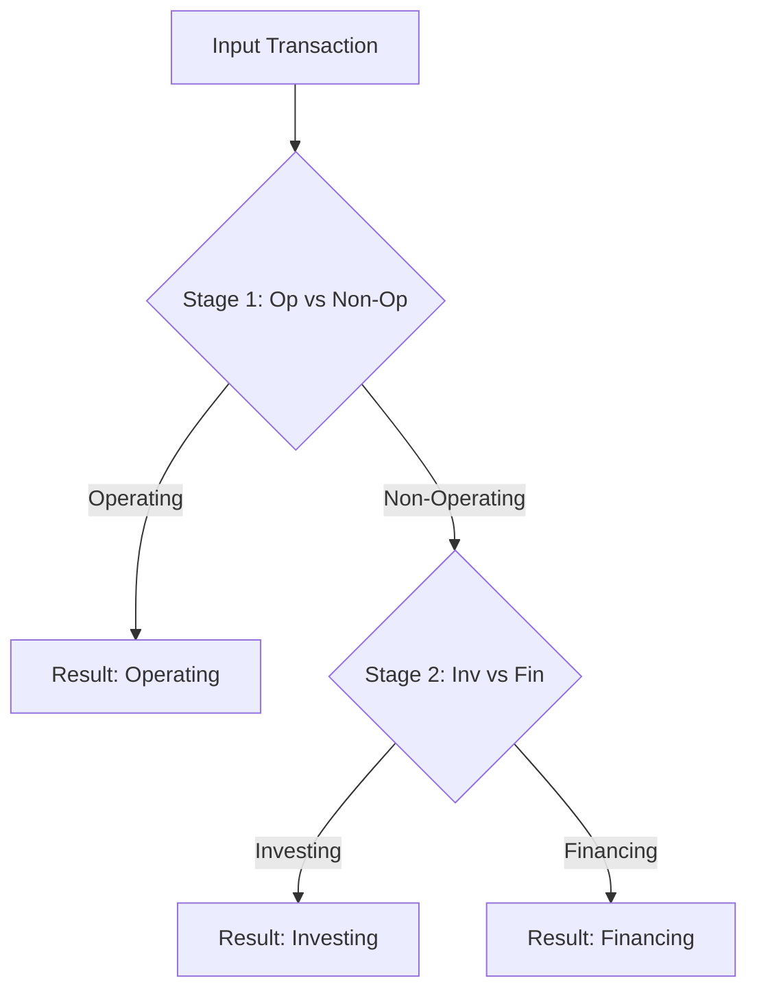

# Model Council Architecture Plan
## Hierarchical Multi-Model Ensemble

### Goal
Implement a sophisticated "Model Council" to improve classification accuracy and confidence by combining multiple distinct models (FinBERT + XGBoost on MiniLM Embeddings) in a hierarchical voting system.

### Architecture Overview

The system will move from a flat 3-class classification to a **2-Stage Hierarchical Classification**:

### The "Council" (Ensemble Logic)

At each stage, a council of models will vote:

| Model | Type | Features | Role |
|-------|------|----------|------|
| **FinBERT V31** | Transformer | Raw Text | Contextual Understanding (Deep Learning) |
| **XGBoost** | Gradient Boosting | MiniLM Embeddings + Amount | Pattern Recognition (Statistical) |

**Voting Mechanism:**
- Weighted Average of probabilities.
- **Stage 1**: $P(Op) = w_1 * P_{BERT}(Op) + w_2 * P_{XGB}(Op)$
- **Stage 2**: $P(Inv) = w_1 * P_{BERT}(Inv) + w_2 * P_{XGB}(Inv)$

### Implementation Steps

#### 1. Dependencies
- Install `sentence-transformers` (for MiniLM embeddings)
- Install `xgboost` and `scikit-learn`

#### 2. Model Training
We need to train **two** new XGBoost models:
1.  **`xgb_op_vs_nonop.json`**:
    -   **Data**: V31 Dataset (balanced)
    -   **Labels**: 1 (Operating) vs 0 (Investing + Financing)
    -   **Features**: MiniLM-L6-v2 embeddings (384 dim) + Transaction Amount (normalized)
2.  **`xgb_inv_vs_fin.json`**:
    -   **Data**: V31 Dataset (filtered for Non-Operating only)
    -   **Labels**: 1 (Investing) vs 0 (Financing)
    -   **Features**: MiniLM-L6-v2 embeddings (384 dim) + Transaction Amount (normalized)

#### 3. Integration (`bert_service.py`)
- Load MiniLM model (global resource)
- Load both XGBoost models
- Update prediction logic to run the hierarchical flow:
    1.  Generate Embedding for input text
    2.  **Council 1**: Get FinBERT Op prob & XGBoost Op prob -> Combine -> If > Threshold then **Operating**
    3.  **Council 2**: If Non-Op -> Get FinBERT Inv/Fin prob & XGBoost Inv/Fin prob -> Combine -> Result

### Advantages
- **Robustness**: XGBoost catches patterns FinBERT might miss (and vice-versa).
- **Control**: Easier to tune "Operating" recall separately from "Investing vs Financing" precision.
- **Explainability**: Can show which model voted for what.

### Next Steps
1.  Install packages.
2.  Create training script `train_model_council.py`.
3.  Run training and save models.
4.  Modify `bert_service.py`.
