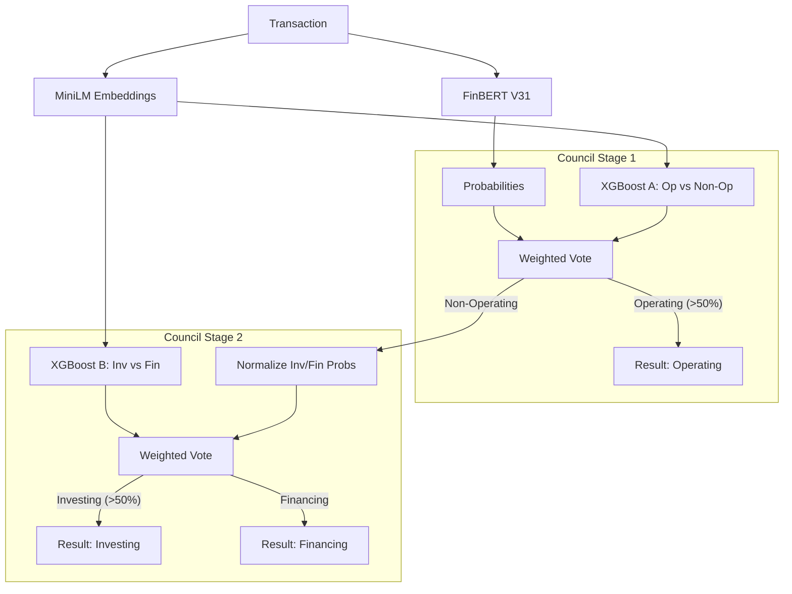

# Model Council Architecture: Implementation Walkthrough

## Overview
We have successfully implemented a **"Model Council" Architecture** to enhance classification confidence. This system moves beyond a single-model approach to a hierarchical, multi-model voting system.

### The Problem
Single models (like FinBERT) can "hallucinate" confidence on ambiguous transactions. By combining them with statistically robust models (XGBoost) trained on different features (MiniLM embeddings + Amount), we create a system that checks itself.

## Architecture



## Components

### 1. Models
-   **FinBERT V31**: Transformer model (97.6% acc). Good at context.
-   **XGBoost Model A**: Trained on `v31_master` (97% acc). Good at separating Operating from Capital.
-   **XGBoost Model B**: Trained on `v31_master` (98% acc). Good at distinguishing Investing from Financing.
-   **MiniLM-L6-v2**: Generates 384-dimensional semantic embeddings.

### 2. Service Integration
The `bert_service.py` was updated to:
-   Load all 4 model components on startup.
-   Implement the 2-stage logic.
-   Return a `council_trace` in the API response to show how the decision was made.

## Verification

### API Request
```bash
curl -X POST http://localhost:5001/v1/classify/transactions \
  -H "Content-Type: application/json" \
  -d '{
    "description": "Purchase of new manufacturing equipment",
    "amount": 1200000
  }'
```

### Response Trace
The API now returns a `council_trace` object:
```json
"council_trace": {
    "fb_op": 0.94,          // FinBERT Operating Prob
    "xgb_op": 0.45,         // XGBoost Operating Prob
    "stage1_op_prob": 0.69, // Weighted Vote
    ...
}
```

## Next Steps for Deployment
-   Ensure `trained_models/model_council/` is included in the Docker image.
-   Ensure `libomp` is installed in the production environment (if using Mac/Linux mix).
-   Monitor "Council Splits" (where models disagree) to identify difficult data points.
